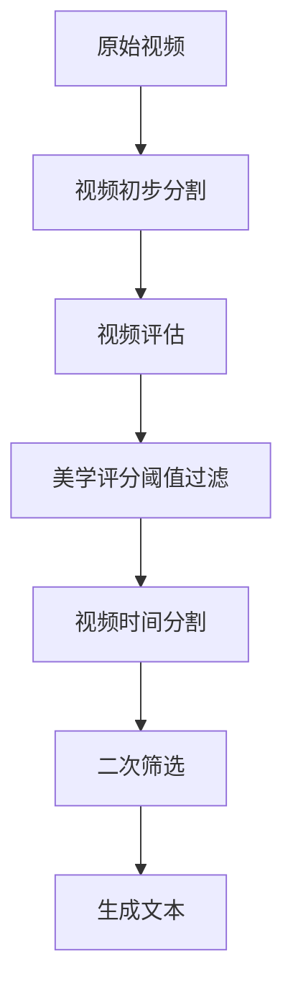

# Modelscope-Sora挑战赛第二名解决方案

诚挚感谢阿里巴巴通义实验室、魔搭社区和阿里云举办的 Modelscope-Sora 挑战赛。为我们提供相互学习的机会。在此次比赛中，我们技术方案充分利用了场景检测、美学评分、光流分析、视频文本标签生成技术，实现了视频的筛选和视频语义一致性的优化。以下是本方案的介绍：

## 工作流程图示


## 目录结构

视频处理的目录结构如下：

```bash
ROOT_VIDEO="/path/to/video/folder" # 原始视频文件夹
ROOT_CLIPS="/path/to/video/clips/folder" # 视频片段文件夹
ROOT_TIMECUT="/path/to/video/timecut/folder" # 时间切割文件夹
ROOT_META="/path/to/meta/folder" # 元数据文件夹
```

## 1. 视频初步分割

从原始视频文件夹中创建元数据文件，获取视频信息，并过滤掉无法解码的视频。使用`scenedetect`库场景检测技术将原始视频进行初步分割成较短片段。

```bash
- 视频数据处理，从视频文件夹创建元数据文件。
python -m tools.datasets.convert video ${ROOT_VIDEO} --output ${ROOT_META}/meta.csv
- 获取视频信息，并过滤掉无法解码的视频。
python -m tools.datasets.datautil ${ROOT_META}/meta.csv --info --fmin 24
- 使用场景检测技术将原始视频分割成较短片段。
python -m tools.scene_cut.scene_detect ${ROOT_META}/meta_info_fmin24.csv
python -m tools.scene_cut.cut ${ROOT_META}/meta_info_fmin1_timestamp.csv --save_dir ${ROOT_CLIPS}
- 视频片段创建元数据文件。
python -m tools.datasets.convert video ${ROOT_CLIPS} --output ${ROOT_META}/meta_clips.csv
- 获取视频信息，并过滤掉无法解码的视频。
python -m tools.datasets.datautil ${ROOT_META}/meta_clips.csv --info --fmin 24
```

## 2. 视频评估

比赛视频数量庞大，需对视频进行美学评分的初步筛选。本方案采用了 CLIP+MLP 美学评分预测模型，以便提取符合美学标准的片段。并对经过分割的视频片段进行详细的评估，同时确保其符合高质量的美学标准。

```bash
- 美学得分计算
torchrun --nproc_per_node 8 -m tools.scoring.aesthetic.inference \
  ${ROOT_META}/meta_clips_info_fmin24.csv \
  --bs 1024 \
  --num_workers 16
```

## 3. 美学评分阈值过滤

对经过评估的视频片段进行初步筛选，确保其符合高质量的美学标准。默认情况下，要求视频片段的平均美学得分≥5。

```bash
- 根据评估结果筛选视频
- 只有满足要求的视频进入下一步
python -m tools.datasets.datautil ${ROOT_META}/meta_clips_info_fmin1_aes.csv --aesmin 5
```

## 4. 视频时间分割

使用 `scenedetect` 库对初步筛选后的视频数据集进行场景切换检测。识别出的场景若持续1至3秒，则将其提取并保存为单独的视频文件；若场景持续时间超过3秒，则将其分割成1至3秒的片段，并分别保存；对于持续时间少于1秒的场景，直接忽略不保存。

```bash
- 将视频按照时间段进行分割
sh tools/video_caption/video_cut.sh
- 视频分割后，创建元数据文件。
python -m tools.datasets.convert video ${ROOT_VIDEO} --output ${ROOT_META}/meta_timecut.csv
```

## 5. 二次筛选

[`data-juicer`](https://github.com/modelscope/data-juicer)是一款一站式多模态数据处理系统，系统内集成了多种高效算子，本系统使用其中的 `video_aesthetics_filter` 算子，该算子用于分析视频的美学得分分布，并根据设定的阈值对视频进行美学过滤。系统通过光流分数来评估视频中的运动程度。光流分数越高，表示视频中的运动越剧烈。使用 `UniMatch` 模型来完成这一任务。`get-flow-and-analyze.py` 用于分析视频的光流得分，而 `get_flow_scores.py` 根据分析结果的阈值进行光流过滤，从而确保视频的动态质量符合预期。

```bash
- 分析视频的美学得分分布
python tools/data-juicer/tools/analyze_data.py --config tools/data-juicer-main/configs/aesthetic.yaml
- 根据分析的阈值评分进行美学过滤
python tools/data-juicer/tools/process_data.py --config tools/data-juicer-main/configs/aesthetic.yaml
- 对视频进行光流评分 
torchrun --standalone --nproc_per_node 8  tools/scoring/optical_flow/inference.py   ${ROOT_META}/meta_timecut_aesfiliter.csv 
- 分析视频的光流得分分布
python  tools/data_tool/get-flow-and-analyze.py
- 根据分析的阈值评分进行光流过滤
python  tools/data_tool/get_flow_scores.py
```

## 6. 生成文本

文本描述主要分为两个步骤，第一步是生成初级文本，第二步是生成总结。

```bash
- 视频生成文本
1.初级文本 
"llava-v1.6-vicuna-7b"  提示词如下
"Describe this video and its style to generate a description. Pay attention to all objects in the video. Do not describe each frame individually. Do not reply with words like 'first frame'.Here are some examples of good descriptions: 1. A stylish woman walks down a Tokyo street filled with warm glowing neon and animated city signage. She wears a black leather jacket, a long red dress, and black boots, and carries a black purse. She wears sunglasses and red lipstick. She walks confidently and casually. The street is damp and reflective, creating a mirror effect of the colorful lights. Many pedestrians walk about. 2. Several giant wooly mammoths approach treading through a snowy meadow, their long wooly fur lightly blows in the wind as they walk, snow covered trees and dramatic snow capped mountains in the distance, mid afternoon light with wispy clouds and a sun high in the distance creates a warm glow, the low camera view is stunning capturing the large furry mammal with beautiful photography, depth of field. 3. Drone view of waves crashing against the rugged cliffs along Big Sur's garay point beach. The crashing blue waters create white-tipped waves, while the golden light of the setting sun illuminates the rocky shore. A small island with a lighthouse sits in the distance, and green shrubbery covers the cliff's edge. The steep drop from the road down to the beach is a dramatic feat, with the cliff edges jutting out over the sea. This is a view that captures the raw beauty of the coast and the rugged landscape of the Pacific Coast Highway."
2.总结
"qwen/qwen2-72B-instruct" 提示词如下
"You are a helpful video description generator. I'll give you a description of the middle frame of the video clip,  \
    which you need to summarize it into a description of the video clip. \
    Please provide your video description following these requirements: \
    1. Describe the basic and necessary information of the video in the third person, be as concise as possible. \
    2.The description should be useful for AI to re-generate the video. \
    3. Output the video description directly. Begin with 'In this video'. \
    4. Limit the video description within 90 words. \
    Here is the mid-frame description: {{query}}"
```

经过上面的流程后，得到高质量的视频和文本描述。以下是拥有描述的视频样本示例：

```json
{"videos": ["./dj_video_46182_scene-0-Scene-003.mp4"], "text": "<__dj__video> In this video, a solitary skier clad in a black snowsuit and helmet stands atop a snowy mountain peak, holding ski poles, against a backdrop of a serene, sunlit, and clear blue sky mountain range. The setting sun bathes the scene in a warm glow as the skier faces the camera, poised and ready to embark on a descent. <|__dj__eoc|>"}
{"videos": ["./dj_video_45166_scene-0-Scene-032.mp4"], "text": "<__dj__video> In this video, a dense forest in fall is showcased, featuring tall, thin trees with green leaves on their branches. The ground is carpeted with a vibrant layer of red leaves, creating a striking and colorful autumn scene. The forest, thick with numerous trees, presents a vivid contrast between the red leaf carpet and the green foliage above. <|__dj__eoc|>"}
{"videos": ["./dj_video_48248_scene-0-Scene-003.mp4"], "text": "<__dj__video> In this video, a focused chef in an apron prepares a meal in a rustic kitchen, using a spoon to mix fresh, colorful ingredients like eggs, tomatoes, garlic, and pasta on a table laden with various items, creating a culinary scene ideal for AI recreation. <|__dj__eoc|>"}
```


## 项目目录结构

```bash
├── data-juicer # data_juicer库文件,可重新下载安装替换编译
│   ├── analyze_data.py # 数据分析筛选
│   ├── process_data.py # 数据生成筛选
│   ├── video_aesthetics_filter.py # 视频美学评分筛选
│   └── configs # 配置文件文件夹
│       └──  aesthetic.yaml # 数据生成筛选配置文件
├── datasets # 视频元数据文件夹
│   ├── convert.py # 视频文件夹创建元数据文件
│   └── datautil.py # 获取视频信息，并过滤掉无法解码的视频
├── generate_caption # 文本生成
│   ├── LLaVA # 初步文本标签生成
│   │   ├── caption_pllava.py #视频文件写文本标签
│   │   └── Readme.md # 
│   ├── qwen # 视频美学评分文件夹
│   │   └── Readme.md # 
├── data_tool # 数据转换和分析文件夹
│   ├── csv_to_jsonl.py #  csv文件转成jsonl文件
│   ├── get-flow-and-analyze.py # 视频光流评分分析脚本
│   ├── get_flow_scores.py # 视频光流评分筛选脚本
│   └──  jsonltocsv.py # jsonl文件转成csv文件
├── scene_cut # 视频初步分割文件夹
│   ├── cut.py # 根据场景检测结果进行视频分割脚本
│   └── scene_detect.py # 场景检测脚本
├── scoring # 视频评分文件夹
│   ├── aesthetic # 视频美学评分文件夹
│   │   ├── inference.py # 视频美学评分脚本
│   │   └── pretrained_models # 模型文件夹
│   └──  optical_flow # 视频光流评分文件夹
│       ├── inference.py # 视频光流评分脚本
│       └── pretrained_models # 模型文件夹
└── video_cut # 视频时间分割文件夹
    ├── scenedetect_vcut.py # 视频分割
    └──  video_cut.sh # 视频分割脚本
```

## 致谢

1.[`Modelscope-Sora挑战赛`](https://tianchi.aliyun.com/competition/entrance/532219)

2.[`data-juicer`](https://github.com/modelscope/data-juicer)

3.[`EasyAnimate`](https://github.com/aigc-apps/EasyAnimate)

4.[`VBench`](https://github.com/Vchitect/VBench)

5.[`ModelScope魔搭社区`](https://community.modelscope.cn/)